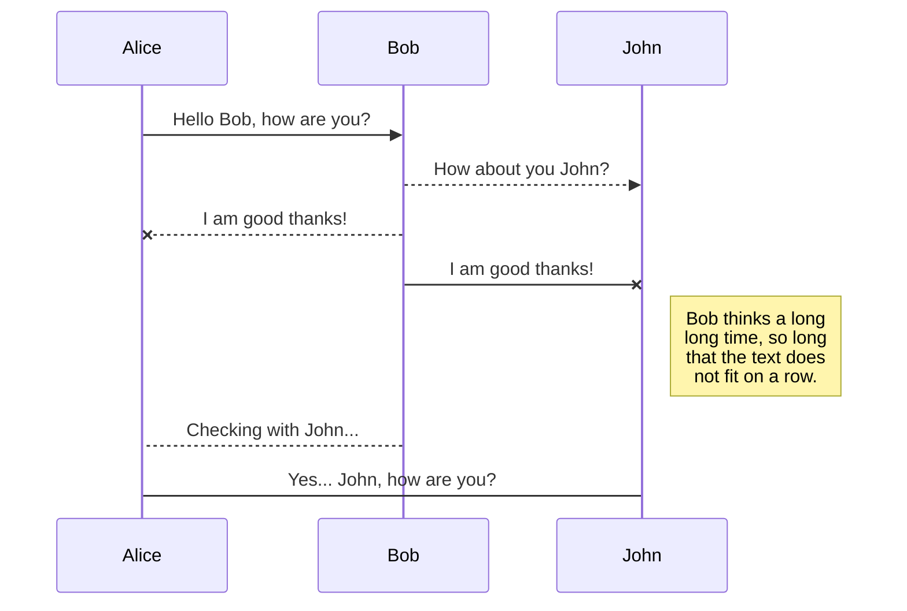
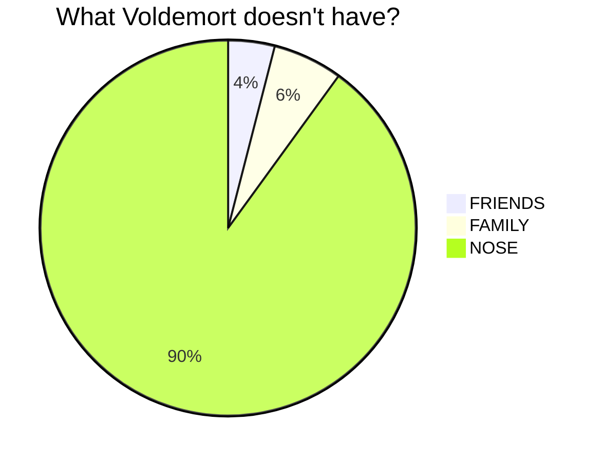
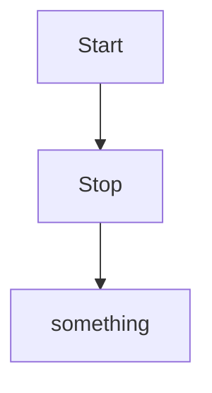
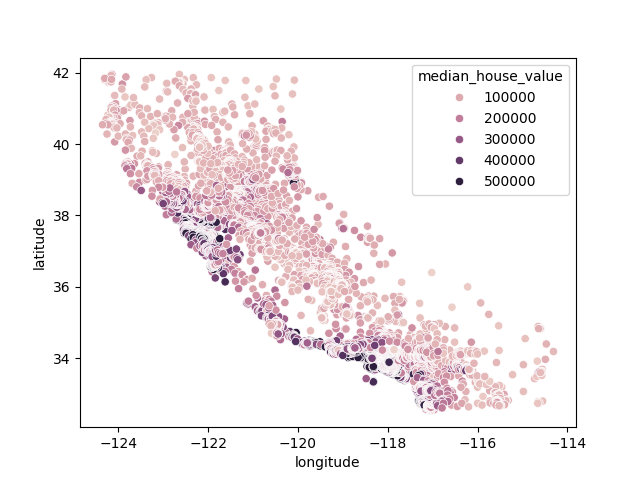

# this is going to explain stuff

## this is another header

- Stuff about things
- more things about stuff

## this is another header to read 

### lower level header
- item 1
- item 2
- **count**
- for

- code
- 
> this is something that I found out by searching for it
> > another quoute inside
> > it's called a nested quote
> it was great
> people do this a lot

```
for index in df.index:
    if str(df['GPA'][index]).replace(".","").isnumeric():
        # it's a number! ---------------------------------
        total = total + float(df["GPA"][index]);
        count = count + 1;
        count = count + 1;
        count = count + 1;
```


[link](https://stackoverflow.com/questions/16669428/process-very-large-20gb-text-file-line-by-line)

<a href="https://stackoverflow.com/questions/16669428/process-very-large-20gb-text-file-line-by-line">this i a link</a>


| Syntax             | Description | column      |
| ------------------ | ----------- | ----------- |
| Header       Title | play        |
| Paragraph          | Text        | around      |
| another row        | try this    | with tables |











